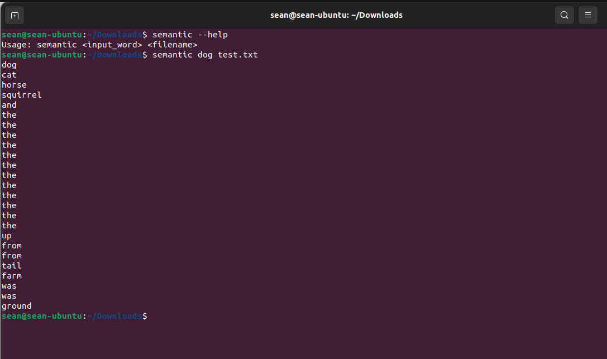

# semantic

## About

`semantic` is a command line tool which uses Machine Learning vectors to find similar words in a text document.

## Installation

- **Step 1**, download and unzip the datasets [glove.twitter.27B.zip](https://nlp.stanford.edu/data/glove.twitter.27B.zip) which can be found in the Stanford NLP lab website: https://nlp.stanford.edu/projects/glove/
- **Step 2**, add the `100-dimensional` vector embeddings to your path: `export GLOVEDATASET=/home/sean/Downloads/glove.twitter.27B/glove.twitter.27B.100d.txt`
- **Step 3**, change the permission for the installer `chmod +x install.sh` and run it `source ./install.sh`

## How it works?
`semantic` uses cosine similarity and vector normalization to find and compare word similarity, i.e., `cosine_similarity(A, B) = dot_product(A, B) / (magnitude(A) * magnitude(B))` and `normalize(V) = V / magnitude(V)`

**Here:**
- `<input_word>` is the word you want to find the nearest words to.
- `<filename>` is the name of the text file that you want to search in.